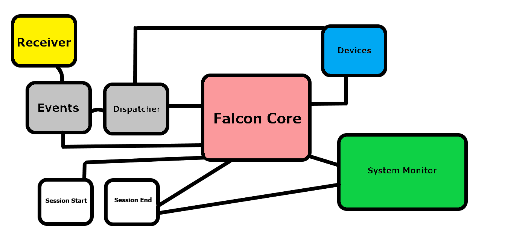

# Falcon Fire Drone

### What is it?
* We are a small community of developers aiming to develop a simple drone that can be used for multiple things like photography, drone piloting, entertainment and various other stuff.

### Features
* Right now **Falcon** is a gradually developing project and not much has been put into it but we can expect something from it in the not so far future.
* We are currently aiming to make a very simple drone that can act as a multipurpose drone and execute simple tasks.

## Getting Started
* To get started with this project we recommend you to use the latest Arduino IDE which you can get it from here - [Arduino IDE](https://www.arduino.cc/en/software).
* Once finished installing the IDE, open up src/FalconFire/FalconFire.ino and compile the project in the IDE. Now you can start developing the code.
* If you cannot compile the project properly then you can raise an issue here - [Falcon Fire Issues](https://github.com/CodedGamer56/Falcon-Fire/issues)
* Once successfully compiled you can visit the workflow of the project to furthur proceed on developing.

## Falcon Fire Workflow

* Falcon Core is the main part of the drone which has control over everything and is also independent.
* Events are dispatched then and there and are also sent to Falcon Core to make sure nothing goes wrong.
* Falcon Core shares all its information with the system monitor which makes sure Falcon Core doesn't malfunction.
* Session start starts all the devices and start up tasks.
* Session end makes sure all the components are turned down and system memory is cleared properly.
* System monitor has also got control over session end so that it can turn down the whole process in case of emergencies or disasters.
>This workflow is not likely to be changed in the future but we still would like to have the community's feedback on this.

## Contributing
* Falcon Fire is free and open sourced which means we welcome your thoughts and ideas on our work and also freely distribute this project to anyone.
* You are free to raise issues and pull requests
* Contributions made is likely to be maintained in a separate branch or might be changed in the future.

### Future Goals
* In the future we would like to successfully create this drone and enhance the community with millions of developers.
* We might also end up creating an universal firmware for people who want to run experiements on a drone quickly without having to type huge lines of code and break their heads to conduct a simple experiement.

